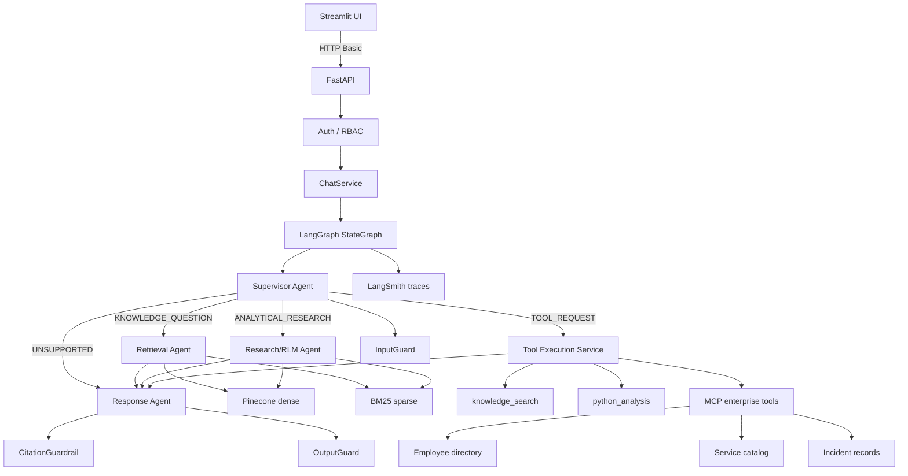

# Enterprise AI Assistant (POC)

An enterprise-grade AI Assistant proof of concept for a commercial bank.
The assistant searches organizational knowledge, answers questions grounded
in enterprise documents with citations, performs multi-step recursive research
(RLM-style), enforces role-based access control, executes secure MCP tool
calls, and is fully observable via LangSmith.

> **Status: feature-complete POC.**  All core capabilities are implemented
> and runnable.  See [Demo Credentials](#demo-credentials) to try it now,
> and [docs/demo-script.md](./docs/demo-script.md) for the recommended
> demonstration flow.

---

## Architecture overview



---

## Implemented capabilities

| Capability | Status |
|---|---|
| LangGraph multi-agent graph | ✅ |
| Supervisor with intent routing | ✅ |
| Retrieval Agent (hybrid dense + BM25 + RRF) | ✅ |
| Research/RLM Agent (recursive, task decomposition) | ✅ |
| Tool Execution Service (8-step authorization pipeline) | ✅ |
| Response Agent (evidence-grounded, citation-validated) | ✅ |
| Prompt injection protection (InputGuard + DocumentInjectionGuard) | ✅ |
| Output safety (OutputGuard + CitationGuardrail) | ✅ |
| RBAC (VIEWER / ANALYST / ADMINISTRATOR) | ✅ |
| MCP enterprise tools (employee, service, incident) | ✅ |
| Controlled Python analysis | ✅ |
| Conversation memory (in-process, bounded) | ✅ |
| FastAPI backend with structured logging | ✅ |
| Streamlit UI with agent activity panel | ✅ |
| LangSmith tracing | ✅ |
| Agent activity / execution trace in API response | ✅ |
| Automated test suite | ✅ |
| Docker Compose | ✅ |
| GitHub Actions CI | ✅ |
| Architecture documentation | ✅ |

---

## Technical stack

| Concern | Technology |
|---|---|
| Language / runtime | Python 3.12 |
| API | FastAPI + uvicorn |
| UI | Streamlit |
| Agent orchestration | LangGraph |
| LLM | Anthropic Claude (claude-sonnet-4-6) |
| Embeddings | OpenAI (text-embedding-3-large) |
| Vector store | Pinecone (serverless) |
| Lexical search | BM25 (in-process) |
| Retrieval fusion | Reciprocal Rank Fusion (RRF) |
| Relational store | PostgreSQL (asyncpg) |
| Cache | Redis |
| Tool protocol | MCP (in-process + standalone server) |
| Observability | LangSmith |
| Containerization | Docker Compose |
| Testing | pytest + pytest-asyncio |
| Linting | Ruff |
| Type checking | mypy |

---

## Repository structure

```
.
├── CLAUDE.md                   # engineering standards (dependency rules, security)
├── README.md
├── pyproject.toml              # dependencies, ruff, mypy, pytest config
├── Makefile                    # dev commands
├── .env.example                # all required environment variables
├── docker-compose.yml          # FastAPI + Streamlit + Postgres + Redis
├── Dockerfile.api
├── Dockerfile.ui
├── .github/workflows/ci.yml    # GitHub Actions CI
├── src/
│   ├── api/                    # FastAPI app and routes
│   ├── agents/                 # LangGraph nodes: supervisor, retrieval, research, response
│   │   ├── supervisor/         # Intent classification and routing
│   │   ├── retrieval/          # Hybrid search node
│   │   ├── research/           # Recursive RLM research node
│   │   ├── response/           # Evidence-grounded response generation
│   │   └── guardrails/         # InputGuard, OutputGuard, CitationGuardrail
│   ├── services/
│   │   ├── chat.py             # Complete LangGraph graph + conversation memory
│   │   └── tool_execution.py   # Centralized 8-step tool authorization gateway
│   ├── retrieval/              # Pinecone + BM25 + RRF hybrid retrieval
│   ├── memory/                 # Conversation persistence (skeleton → Postgres)
│   ├── mcp/                    # MCP server + in-process client adapter
│   ├── tools/                  # Controlled Python analysis
│   ├── security/               # Auth (POC hardcoded) + RBAC authorization policy
│   ├── observability/          # LangSmith tracing
│   ├── core/                   # Config, structured logging, redaction
│   └── models/                 # Pydantic schemas
├── tests/                      # pytest suite mirroring src/
├── scripts/
│   ├── streamlit_app.py        # Chat UI with agent activity panel
│   ├── ingest.py               # Document ingestion CLI
│   └── index.py                # Pinecone indexing CLI
├── data/knowledge/             # Synthetic bank dataset (65+ documents)
└── docs/                       # Architecture, security, RLM, retrieval docs
```

---

## Getting started

### Prerequisites

- Python 3.12
- API keys: Anthropic, OpenAI, Pinecone (see [Required API keys](#required-api-keys))
- LangSmith key (optional, for tracing)

### Local setup (no Docker)

```bash
python -m venv .venv
source .venv/bin/activate        # Windows: .venv\Scripts\activate
pip install -e ".[dev]"
cp .env.example .env             # fill in your API keys
```

### Run

```bash
make api          # FastAPI at http://localhost:8000  (Swagger: /docs)
make streamlit    # Streamlit UI at http://localhost:8501
```

### Docker Compose

```bash
cp .env.example .env    # add API keys
docker compose up --build
# API:       http://localhost:8000
# UI:        http://localhost:8501
```

### Index documents

```bash
# Ingest the synthetic knowledge base into Pinecone
python scripts/index.py --data-dir data/knowledge --init
```

### Test & lint

```bash
make test        # pytest
make lint        # ruff check
make typecheck   # mypy
make check       # all of the above
```

---

## Demo credentials

| Username | Password | Role |
|---|---|---|
| `viewer01` | `Viewer01#Poc2026` | VIEWER |
| `analyst01` | `Analyst01#Poc2026` | ANALYST |
| `admin01` | `Admin01#Poc2026` | ADMINISTRATOR |

**VIEWER** — chat, knowledge search only.  Cannot use analytics or MCP tools.
**ANALYST** — chat, search, Python analysis, MCP tools.
**ADMINISTRATOR** — all permissions.

---

## Required API keys

| Variable | Purpose | Required |
|---|---|---|
| `ANTHROPIC_API_KEY` | LLM calls (Claude) | Yes |
| `OPENAI_API_KEY` | Embeddings (text-embedding-3-large) | Yes |
| `PINECONE_API_KEY` | Vector store | Yes |
| `PINECONE_INDEX_NAME` | Pinecone index name | Yes |
| `LANGCHAIN_API_KEY` | LangSmith tracing | Optional |

---

## Key design decisions

- **LangGraph StateGraph** — graph topology is explicit and directly readable;
  not hidden behind a framework abstraction.
- **Deterministic security gates** — RBAC, input validation, and citation
  checking are pure Python functions, never LLM-dependent.
- **RLM research** — complex questions decompose into a tree of sub-tasks, each
  analyzing a bounded batch of evidence; prevents single-LLM context overflow.
- **No direct tool calls** — the LLM expresses intent; `ToolExecutionService`
  decides whether it's allowed (existence → params → RBAC → budget → timeout →
  execute → output validation → audit).

See [`docs/`](./docs/) for detailed design rationale.

---

## Known limitations (POC simplifications)

| Simplification | Production path |
|---|---|
| Hardcoded users in `poc_users.py` | Keycloak / OIDC |
| In-memory conversation history dict | PostgreSQL + LangGraph checkpointer |
| In-process BM25 corpus | Elasticsearch / OpenSearch |
| HTTP Basic auth | Bearer token (JWT) |
| In-process rate limiting | Redis token bucket |
| Synthetic enterprise MCP data | Real MCP server integration |

---

## Documentation

- [`docs/architecture.md`](./docs/architecture.md) — full system design
- [`docs/rlm.md`](./docs/rlm.md) — recursive research agent design
- [`docs/retrieval.md`](./docs/retrieval.md) — hybrid retrieval pipeline
- [`docs/security.md`](./docs/security.md) — threat model and guardrails
- [`docs/authentication.md`](./docs/authentication.md) — auth and RBAC
- [`docs/observability.md`](./docs/observability.md) — LangSmith tracing
- [`docs/memory.md`](./docs/memory.md) — conversation memory design
- [`docs/demo-script.md`](./docs/demo-script.md) — **recommended demo flow**

---

## License

Proprietary — internal POC, not for external distribution.
